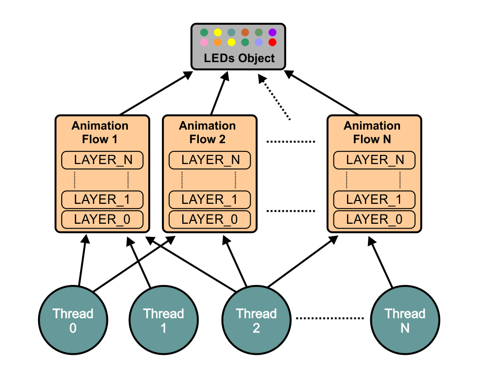

# AnimaTools

AnimaTools is a C++ library for controlling addressable LEDs on ESP32 using FreeRTOS within the Arduino framework.

It provides a structured way to build complex LED animations using layered effects, thread-safe flows, and flexible brightness control.

## Features
### LED and Animation Abstraction

The library separates LED hardware control from animation logic.
Animation flows operate on LED objects and define how visual effects evolve over time.
Multiple flows can interact with the same LED object, allowing animations to be controlled from different classes or subsystems.

### Multi-Layer Effect System

Animations are built using a layer-based architecture.

Each layer contains: color, mask and opacity. By manipulating these parameters, complex effects and smooth transitions can be created using simple and readable code.

### Thread-Safe Design

Animation flows are designed to be thread-safe.

They can be accessed and controlled from multiple FreeRTOS tasks without causing race conditions or inconsistent LED states.

### Separate Brightness Management

Brightness is controlled at two different levels:

- *Global brightness*. Managed by the main LED object and corresponds device brightness level.
- *Flow brightness*. Each animation flow has its own brightness control, allowing dynamic behaviors such as pulsing or breathing.

### Built-In Animation Helpers

The library provides common animation primitives, including:
- Fade-in / fade-out.
- Periodic modulation.

These can be applied to brightness or layer opacity allowing expressive animation patterns with minimal code.

## Diagram


## Basic Usage
```cpp
#define LED_PIN 2
#define N_LED_UNITS 64
#define N_LAYERS 2
#define LEDS_UPDATE_MS 20

// Create LEDs object
AnimaLeds<LED_PIN, N_LED_UNITS> animaLeds;
// Create Flow object and bind to LEDs
AnimaFlow<N_LED_UNITS, N_LAYERS> animaFlow(animaLeds);
// Create object for breathing pattern
AnimaEnvelope breathing;

void setup()
{
    // Turn LEDs on with 500ms fade in reveal
    animaLeds.on(500);
    // Connect animaFlow to LEDs
    animaFlow.connect();

    // Make breathing patter with 1200ms period, 0.7 brightness range and 0.25 duty factor
    breathing.make_breathing(1200, 0.7f, 0.25f);

    // Set red color for LAYER_0 and make it fully opaque
    animaFlow.set_solid(LAYER_0, CRGB::Red);
    animaFlow.show_layer(LAYER_0);

    // Set green color for LAYER_1 and run
    // periodic opacity change according to breathing pattern
    animaFlow.set_solid(LAYER_1, CRGB::Green);
    animaFlow.start_opacity_envelope(LAYER_1, breathing);

    // Run update_and_show() for LEDs object with LEDS_UPDATE_MS interval
    xTaskCreatePinnedToCore(
        [](void *param)
        {
            TickType_t xLastWakeTime = xTaskGetTickCount();
            const TickType_t xTimeout = pdMS_TO_TICKS(LEDS_UPDATE_MS);
            while (true)
            {
                animaLeds.update_and_show();
                xTaskDelayUntil(&xLastWakeTime, xTimeout);
            }
        },
        "Leds Update Task",
        8192,
        NULL,
        1,
        NULL,
        tskNO_AFFINITY);
}

void loop()
{
}

```

## Control methods
```cpp
// == MASK
void set_mask(uint8_t layer_i, const std::array<bool, N_LED_UNITS> &mask);
void enable_mask_all(uint8_t layer_i);
void disable_mask_all(uint8_t layer_i);
void enable_mask_single(uint8_t layer_i, int i);
void disable_mask_single(uint8_t layer_i, int i);
void enable_mask_range(uint8_t layer_i, int start_i, int end_i);
void disable_mask_range(uint8_t layer_i, int start_i, int end_i);

// == COLOR
void set_colors(uint8_t layer_i, const std::array<CRGB, N_LED_UNITS> &rgb);
void set_solid(uint8_t layer_i, const CRGB &color);
void set_solid(uint8_t layer_i, const CRGB &color, int start_i, int end_i);
void set_hue(uint8_t layer_i, uint8_t num_sectors, uint8_t units_per_color = 1, uint8_t hue_shift = 0);

// == OPACITY
void set_opacity(uint8_t layer_i, float opac);
void fade_opacity(uint8_t layer_i, float opac_dest, millis_t duration_ms = FADE_DFLT_MS);
void show_layer(uint8_t layer_i, millis_t duration_ms = FADE_DFLT_MS);
void hide_layer(uint8_t layer_i, millis_t duration_ms = FADE_DFLT_MS);

void apply_opacity_envelope(uint8_t layer_i, const AnimaEnvelope &env);
void start_opacity_envelope(uint8_t layer_i);
void start_opacity_envelope(uint8_t layer_i, const AnimaEnvelope &env);

// == BRIGTNESS
void set_brightness(float br);
void fade_brightness(float bright_dest, millis_t duration_ms = FADE_DFLT_MS);

void apply_brightness_envelope(const AnimaEnvelope &env, bool apply_dc_offset = false);
void start_brightness_envelope();
void start_brightness_envelope(const AnimaEnvelope &env, bool apply_dc_offset = false);

```